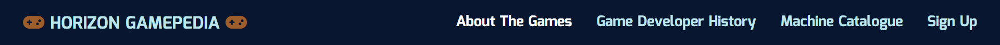
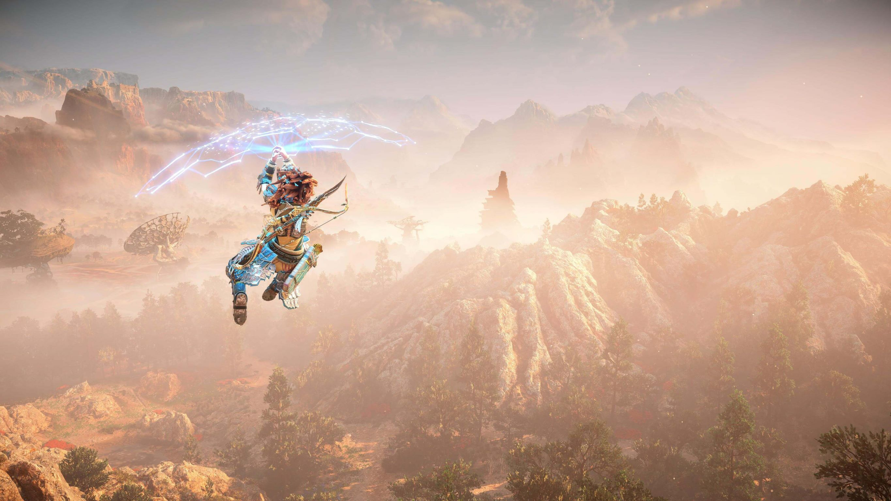
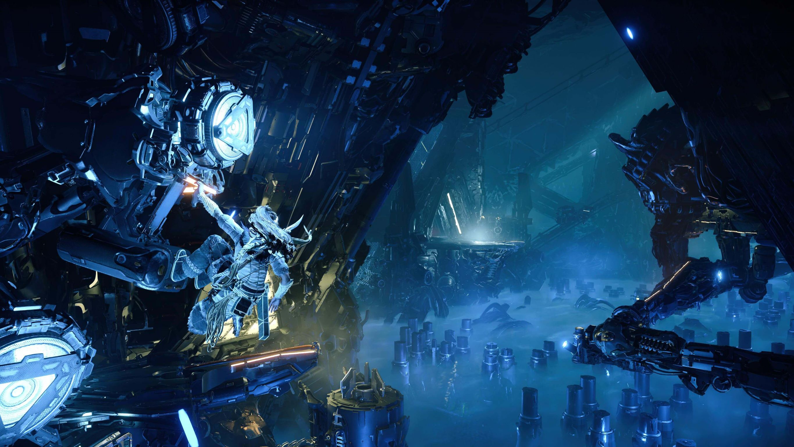
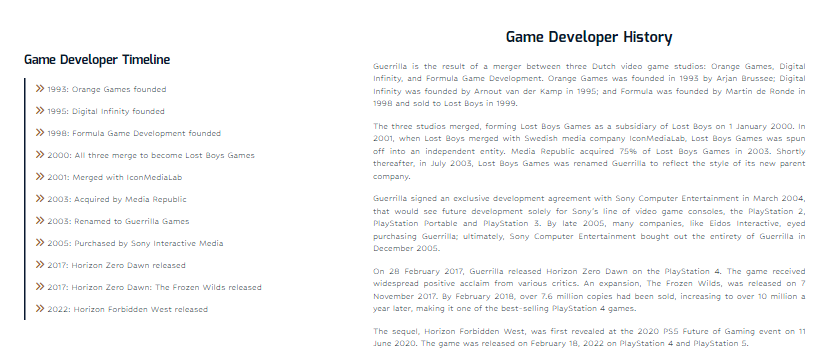
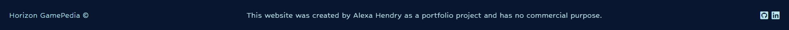

<h1 align="center">Horizon GamePedia Website</h1>

[The Horizon GamePedia website](https://alexah88.github.io/horizon-gamepedia/) has been developed for all the Horizon game franchise (Zero Dawn and Forbidden West) fans out there. The user can read up about the history of the games and how they were developed by the game studio Guerrilla Games, view the machine catalogue to get tips on how to defeat the machines in the games, and sign up to receive the newsletter for further information.

<h2 align="center"></h2>

## __User Experience (UX)__

-   ### ***User stories***

    -   #### First Time Visitor Goals

        1. As a First Time Visitor, I want to easily understand the main purpose of the site and learn more about the organisation.
        2. As a First Time Visitor, I want to be able to easily navigate throughout the site to find content.
        3. As a First Time Visitor, I want to look for testimonials to understand what their users think of them and see if they are trusted. I also want to locate their social media links to see their followings on social media to determine how trusted and known they are.

    -   #### Returning Visitor Goals

        1. As a Returning Visitor, I want to find information about coding challenges.
        2. As a Returning Visitor, I want to find the best way to get in contact with the organisation with any questions I may have.
        3. As a Returning Visitor, I want to find community links.

    -   #### Frequent User Goals
        1. As a Frequent User, I want to check to see if there are any newly added challenges or hackathons.
        2. As a Frequent User, I want to check to see if there are any new blog posts.
        3. As a Frequent User, I want to sign up to the Newsletter so that I am emailed any major updates and/or changes to the website or organisation.

-   ### ***Design***
    
    -   #### Colour Palette

        - The colour palette is made up of four colours: 
          - Dark blue #08172F
          - Light blue #BDE5EC
          - Dark brown #9D5E2B
          - White #FFF

        - The first three colours are taken from the hero images, all the while taking into account their compatibility with each other and the site as a whole. White #fff is used as the fourth colour on the site as a neutral tone.

        

        

        

        
    
    -   #### Typography

        -   The 'Hubballi' and 'Mina' fonts are used across the site, with  Hubballi being used for the body text and Mina for the h1, h2, h3 heading. These fonts were chosen as they resemble the in-game fonts fairly closely, as seen by the [Horizon Zero Dawn Logo](https://commons.wikimedia.org/wiki/File:Logo_Horizon_Zero_Dawn.svg):
        
            
    
    -   #### Imagery

        -   Each page has its own hero image to immediately immerse the user into the breath-taking world of the Horizon games - whether it be existing fans of the games or newcomers coming to learn more about the world of Horizon. They are all in-game shots and thus allow the user to imagine themselves in the Horizon universe. 

        -   The other images on the page are of the enemeny machines and can be found on the Machine Catalogue page. These images have been selected specifically as they show the machines on their own, without any other characters or other machines, so as to make clear to the user which machine is being described. They are also good-quality, in-game images to give the user the feeling of experiencing the game directly.   

-   ### ***Wireframes***

    -   About The Games page:
        

    -   Game Developer History page:
        

    -   Machine Catalogue page:
        

    -   Sign Up page:
        

    -   Login section (future implementation):
        

    -   Tribe Quiz page (future implementation):
        

## __Features__

### ***Existing Features***

- #### Navigation Bar

  

  - The navigation bar includes five clickable links, allowing the user to easily access the four pages on the site: 
    - Horizon GamePedia site name (links to the About The Games home page)
    - About The Games page
    - Game Developer History page
    - Machine Catalogue page
    - Sign Up page

  - In order to make navigation easier for the user, the navigation bar is in a fixed position, meaning that it remains at the top of the page as the user scrolls down.

  - The navigation bar follows the same style and size as the footer, and appears in the same format on all four pages - this allows for consistency throughout the site.

  - A hover effect of the text turning white is included, allowing the user to understand that the link is clickable. Once the link has been clicked, the text remains white to indicate to the user which page they find themselves on. 

  - The navigation bar was created with HTML and CSS only and is fully responsive across devices.
    

- #### Hero Images

  - Each page has its own hero image to immediately immerse the user into the breath-taking world of the Horizon games - whether it be existing fans of the games or newcomers coming to learn more about the world of Horizon.

    - About The Games Hero Image:
    

    - Game Developer History Hero Image:
    

    - Machine Catalogue Hero Image:
    

    - Sign Up Hero Image:
    

- #### About The Games Page

  

  - The About The Games page is the landing page of the website and as the user's first port of call serves to inform the user about the Horizon games franchise.
  
  - The page is split into three sections:
    - Information about the games in general, detailing what type of gaming experience the player can expect.  
    - A synopsis on the first game release, Zero Dawn, including a video trailer of the game. 
    - A synopsis on the second game release, Forbidden West, including a video trailer of the game.

- #### Game Developer History Page

  

  - The Game Developer History page serves to provide background to the user about who created the games and how they came to exist.

  - The page is split into two sections:
    - A timeline of key dates leading to the creation of the developer of the games, Guerrilla Games.
    - A detailed history of how the game studio, Guerrilla Games, came to be.  

- #### Machine Catalogue Page

  
  
  

  - The Machine Catalogue page allows the user to find out more about the enemy machines in the game, as well as tips on how to beat them in both the first and second intallments of the Horizon games. 

  - The page is split into three sections:
    - Background information on what the machines are in the games and how they were developed. 
    - Videos introducing the user to the different machine types that exist in both games (Zero Dawn and Forbidden West).
    - A catalogue of six machines that appear in both games, including images, machine names, and info on their strenghts, weaknesses and cauldron locations that allow them to be overriden and controlled. This valuable information is helpful to the user to enable them to beat the machines and master the games. 

- #### Sign Up Page

  

  - The Sign Up page encourages the user to join the Horizon gaming community, and to connect with fellow gamers, allowing for social connection. Please note that the community and newsletter are not currently functional on this project and would be implemented in future developments. 

  - The page contains one section, in the shape of a form that covers three areas:
    - User details, including first name, last name and email address.
    - A survey to find out more about the user's profile, and including age, gender, gaming hours, and gaming style. 
    - The option to sign up for the newsletter. 

- #### The Footer

  

  - The footer follows the same style and size as the navigation bar, and appears in the same format on all four pages - this allows for consistency throughout the site.

  - The footer contains three elements:
    - The copyrighted site name on the left hand side. 
    - Information abou the site and how it was created. 
    - Social media links, allowing the user to visit the site creator's LinkedIn and GitHub pages.

  - The footer was created with HTML and CSS only and is fully responsive across devices.

    

### ***Future Implementations***

- #### General
  
  - Use a [recreation of the in-game font](https://www.fontspace.com/category/horizon-zero-dawn) for headings across the site.

  - Add a Tribe Quiz page with JavaScript, allowing the user to answer questions about their gaming style resulting in being assigned to a tribe from the Horizon universe. 

  - Add a chat room function to the site for users to be able to connect socially. 

- #### Navigation Bar
  
  - Add sub-menu on navigation bar, linking to the h3 and h4 sections on the site.

  - Make header invisible on smaller viewports and allow for swipe down or hover to make it appear. 

  - Improve the hamburger menu functionality by using a JavaScript version instead. 

- #### Hero Images

  - Add a text box or scroll down arrow on the hero images to make it clearer to users that there is content below the images - as they take up a lot of the screen space in order to be visually striking.  

- #### Machine Catalogue Page

  - Include all the machines from the Horizon games to have the full collection of existing machines. 

  - Make the machine catalogue info text on the images visually more appealing on smaller viewports, for example using a different system instead e.g. modals with Java. 

- #### Sign Up Page

  - Make the newsletter an actual function of the site.

  - Create user profile and login options in order to create a true community where users can connect. 

  - Make the how many hours a day do you play selector into a range slider instead and show the 1-24 hour values with JavaScript. 

- #### The Footer

  - Add a back to top arrow or button to allow the user to get back to the top of the screen easily. 

## __Technologies Used__

### ***Languages Used***

-   [HTML5](https://en.wikipedia.org/wiki/HTML5)

-   [CSS3](https://en.wikipedia.org/wiki/Cascading_Style_Sheets)

### ***Frameworks, Libraries & Programs Used***

1. [Google Fonts:](https://fonts.google.com/)
    - Google Fonts was used to import the 'Hubballi' and 'Mina' fonts into the style.css file which is used on all pages throughout the project. [Hubballi](https://fonts.google.com/specimen/Hubballi?query=hubball) is used for the body and [Mina](https://fonts.google.com/specimen/Mina?query=mina) for the h1, h2, h3 headings.

1. [Font Awesome:](https://fontawesome.com/)
    - Font Awesome was used on all pages throughout the website to add icons for aesthetic and UX purposes.

1. [Color Designer:](https://colordesigner.io/)
    - Color Designer was used to create the colour scheme for the website, by picking colours from the hero images.

1. [Git:](https://git-scm.com/)
    - Git was used for version control by utilizing the Gitpod terminal to commit to Git and Push to GitHub.

1. [GitHub:](https://github.com/)
    - GitHub is used to store the projects code after being pushed from Git.

1. [Balsamiq:](https://balsamiq.com/)
    - Balsamiq was used to create the wireframes during the design process.

1. [Chrome DevTools:](https://developer.chrome.com/docs/devtools/)
    - Chrome DevTools was used to consistently check the site in terms of responsivity, performance, accessibility, best practice and SEO.

1. [Font Awesome Favicon Generator:](https://gauger.io/fonticon/)
    - Font Awesome Favicon Generator was used to reproduce a favicon version of the [Font Awesome Gamepad Icon](https://fontawesome.com/icons/gamepad?s=solid) used in the header site name.

1. [Responsinator:](https://www.responsinator.com/)
    - Responsinator was used to check responsivity across all devices.

## __Testing__

### ***HTML and CSS Testing***

-   [W3C Markup Validator](https://jigsaw.w3.org/css-validator/#validate_by_input) was used to validate every page of the project to ensure there were no HTML syntax errors in the project.
    - [Results index.html](assets/testing/testing-html-index.pdf)
    - [Results game-developer-history.html](assets/testing/testing-html-game-developer-history.pdf)
    - [Results machine-catalogue.html](assets/testing/testing-html-machine-catalogue.pdf)
    - [Results sign-up.html](assets/testing/testing-html-sign-up.pdf)

-   [W3C CSS Validator](https://jigsaw.w3.org/css-validator/#validate_by_input) was used to validate every page of the project to ensure there were no CSS syntax errors in the project.
    - [Results style.css](assets/testing/testing-style-css.pdf)

### ***Performance, Accessibility, Best Practices, and SEO Testing***

- #### Desktop Testing with [Chrome DevTools Lighthouse](https://developers.google.com/web/tools/lighthouse)
  - [About The Games Page](assets/testing/testing-lighthouse-index-desktop.pdf)
  - [Game Developer History Page](assets/testing/testing-lighthouse-developer-history-desktop.pdf)
  - [Machine Catalogue Page](assets/testing/testing-lighthouse-machine-catalogue-desktop.pdf)
  - [Sign Up Page](assets/testing/testing-lighthouse-sign-up-desktop.pdf)

- #### Mobile Testing with [Chrome DevTools Lighthouse](https://developers.google.com/web/tools/lighthouse)
  - [About The Games Page](assets/testing/testing-lighthouse-index-mobile.pdf)
  - [Game Developer History Page](assets/testing/testing-lighthouse-developer-history-mobile.pdf)
  - [Machine Catalogue Page](assets/testing/testing-lighthouse-machine-catalogue-mobile.pdf)
  - [Sign Up Page](assets/testing/testing-lighthouse-sign-up-mobile.pdf)

- #### Further Accessibility Testing

  - [EightShapes Contrast Grid](http://eightshapes.com/) was used to test the colour palette of the site for any accessibility issues. Only AAA and AA rating options were used on the site. 
  
  
  - Any icons on the site that are for decorative purposes only use the aria-hidden="true" attribute to accommodate for accessibility, as recommended by [Font Awesome's Accessiblity Page           (https://fontawesome.com/v5/docs/web/other-topics/accessibility)
  

### ***Testing User Stories from User Experience (UX) Section***

-   #### First Time Visitor Goals

    1. As a First Time Visitor, I want to easily understand the main purpose of the site and learn more about the organisation.

        1. Upon entering the site, users are automatically greeted with a clean and easily readable navigation bar to go to the page of their choice. Underneath there is a Hero Image with Text and a "Learn More" Call to action button.
        2. The main points are made immediately with the hero image
        3. The user has two options, click the call to action buttons or scroll down, both of which will lead to the same place, to learn more about the organisation.

    2. As a First Time Visitor, I want to be able to easily be able to navigate throughout the site to find content.

        1. The site has been designed to be fluid and never to entrap the user. At the top of each page there is a clean navigation bar, each link describes what the page they will end up at clearly.
        2. At the bottom of the first 3 pages there is a redirection call to action to ensure the user always has somewhere to go and doesn't feel trapped as they get to the bottom of the page.
        3. On the Contact Us Page, after a form response is submitted, the page refreshes and the user is brought to the top of the page where the navigation bar is.

    3. As a First Time Visitor, I want to look for testimonials to understand what their users think of them and see if they are trusted. I also want to locate their social media links to see their following on social media to determine how trusted and known they are.
        1. Once the new visitor has read the About Us and What We Do text, they will notice the Why We are Loved So Much section.
        2. The user can also scroll to the bottom of any page on the site to locate social media links in the footer.
        3. At the bottom of the Contact Us page, the user is told underneath the form, that alternatively they can contact the organisation on social media which highlights the links to them.

-   #### Returning Visitor Goals

    1. As a Returning Visitor, I want to find the new programming challenges or hackathons.

        1. These are clearly shown in the banner message.
        2. They will be directed to a page with another hero image and call to action.

    2. As a Returning Visitor, I want to find the best way to get in contact with the organisation with any questions I may have.

        1. The navigation bar clearly highlights the "Contact Us" Page.
        2. Here they can fill out the form on the page or are told that alternatively they can message the organisation on social media.
        3. The footer contains links to the organisations Facebook, Twitter and Instagram page as well as the organization's email.
        4. Whichever link they click, it will be open up in a new tab to ensure the user can easily get back to the website.
        5. The email button is set up to automatically open up your email app and autofill there email address in the "To" section.

    3. As a Returning Visitor, I want to find the Facebook Group link so that I can join and interact with others in the community.
        1. The Facebook Page can be found at the footer of every page and will open a new tab for the user and more information can be found on the Facebook page.
        2. Alternatively, the user can scroll to the bottom of the Home page to find the Facebook Group redirect card and can easily join by clicking the "Join Now!" button which like any external link, will open in a new tab to ensure they can get back to the website easily.
        3. If the user is on the "Our Favourites" page they will also be greeted with a call to action button to invite the user to the Facebook group. The user is incentivized as they are told there is a weekly favourite product posted in the group.

-   #### Frequent User Goals

    1. As a Frequent User, I want to check to see if there are any newly added challenges or hackathons.

        1. The user would already be comfortable with the website layout and can easily click the banner message.

    2. As a Frequent User, I want to check to see if there are any new blog posts.

        1. The user would already be comfortable with the website layout and can easily click the blog link

    3. As a Frequent User, I want to sign up to the Newsletter so that I am emailed any major updates and/or changes to the website or organisation.
        1. At the bottom of every page their is a footer which content is consistent throughout all pages.
        2. To the right hand side of the footer the user can see "Subscribe to our Newsletter" and are prompted to Enter their email address.
        3. There is a "Submit" button to the right hand side of the input field which is located close to the field and can easily be distinguished.

### ***Further Testing***

-   The Website was tested on Google Chrome, Firefox, and Microsoft Edge browsers.

-   The website was viewed on a variety of devices such as Desktop up to 28 inch screen with 4k resolution, Laptop, Pixel 3a, Pixel 4, Samsung Galaxy Tab S5e.

-   A large amount of testing was done to ensure that all pages were linking correctly.

-   Friends and family members were asked to review the site and documentation to point out any bugs and/or user experience issues.

### ***Known Bugs***

-   On some mobile devices, notably the Pixel 3a the form fieldset on the Sign Up page pushes the size of screen out more than any of the other content on the page. A white gap can be seen to the right of the footer and navigation bar as a result. However, this issue does not appear on [Chrome DevTools](https://developers.google.com/web/tools) or [Responsinator](https://www.responsinator.com/)
    - [Pixel 3a Bug](assets/testing/testing-bugs-sign-up-form-pixel3a.png)
    - [Responsinator Resolved Bug](assets/testing/testing-bugs-sign-up-form-responsinator.png)
    - [Chrome DevTools Resolved Bug 450px Viewport](assets/testing/testing-bugs-sign-up-form-chrome-devtools-450px.png)
    - [Chrome DevTools Resolved Bug 350px Viewport](assets/testing/testing-bugs-sign-up-form-chrome-devtools-350px.png)

## __Deployment__

### ***GitHub Pages***

The project was deployed to GitHub Pages using the following steps:

1. Log in to GitHub and locate the [GitHub Repository](https://github.com/AlexaH88/portfolio-project-1)
2. At the top of the Repository (not top of page), locate the "Settings" Button on the menu.
    - Alternatively Click [Here](https://raw.githubusercontent.com/) for a GIF demonstrating the process starting from Step 2.
3. Scroll down the Settings page until you locate the "GitHub Pages" Section.
4. Under "Source", click the dropdown called "None" and select "Master Branch".
5. The page will automatically refresh.
6. Scroll back down through the page to locate the now published site [link](https://alexah88.github.io/portfolio-project-1/) in the "GitHub Pages" section.

### ***Forking the GitHub Repository***

By forking the GitHub Repository we make a copy of the original repository on our GitHub account to view and/or make changes without affecting the original repository by using the following steps:

1. Log in to GitHub and locate the [Horizon GamePedia GitHub Repository](https://github.com/AlexaH88/horizon-gamepedia)
2. At the top of the Repository (not top of page) just above the "Settings" Button on the menu, locate the "Fork" Button.
3. You should now have a copy of the original repository in your GitHub account.

### ***Making a Local Clone***

1. Log in to GitHub and locate the [Horizon GamePedia GitHub Repository](https://github.com/AlexaH88/horizon-gamepedia)
2. Under the repository name, click "Clone or download".
3. To clone the repository using HTTPS, under "Clone with HTTPS", copy the link.
4. Open Git Bash
5. Change the current working directory to the location where you want the cloned directory to be made.
6. Type `git clone`, and then paste the URL you copied in Step 3.

```
$ git clone https://github.com/AlexaH88/horizon-gamepedia
```

7. Press Enter. Your local clone will be created.

```
$ git clone https://github.com/AlexaH88/horizon-gamepedia
> Cloning into `CI-Clone`...
> remote: Counting objects: 10, done.
> remote: Compressing objects: 100% (8/8), done.
> remove: Total 10 (delta 1), reused 10 (delta 1)
> Unpacking objects: 100% (10/10), done.
```

Click [Here](https://help.github.com/en/github/creating-cloning-and-archiving-repositories/cloning-a-repository#cloning-a-repository-to-github-desktop) to retrieve pictures for some of the buttons and more detailed explanations of the above process.

## __Credits__

### ***Code***

- The following were used as references to help with writing the HTML and CSS code:
  - [Code Institute LMS](https://learn.codeinstitute.net/ci_program/diplomainsoftwaredevelopmentecommerce), in particular the [CI Love Running Walkthrough](https://learn.codeinstitute.net/courses/course-v1:CodeInstitute+LR101+2021_T1/courseware/4a07c57382724cfda5834497317f24d5/f2db5fd401004fccb43b01a6066a5333/)
  - [W3Schools](https://www.w3schools.com/) 
  - [Stack Overflow](https://stackoverflow.com/)
  - [MDN Web Docs](https://developer.mozilla.org/en-US/)

- The media queries was taken in part from the [CI Love Running Walkthrough](https://github.com/Code-Institute-Solutions/love-running-2.0-sourcecode/blob/main/08-responsive-elements/01-club-ethos-media-queries-tablet/assets/css/style.css)

- The code to embed the two video trailers on the About The Games and Machine Catalogue pages was taken from the share option on [YouTube](https://www.youtube.com/) directly and adapted for the site's needs.
  - [Horizon Zero Dawn Trailer](https://www.youtube.com/watch?v=wzx96gYA8ek)
  - [Horizon Forbidden West Trailer](https://www.youtube.com/watch?v=Lq594XmpPBg&t=4s)
  - [Horizon Zero Dawn Machines Trailer](https://www.youtube.com/watch?v=uMKAdNWv9xA)
  - [Horizon Forbidden West Machines Trailer](https://www.youtube.com/watch?v=pY86drmNdV8)

- The text box fade on the Machine Catalogue page images was taken from [W3Schools](https://www.w3schools.com/), specifically from [Fade In A Box](https://www.w3schools.com/css/tryit.asp?filename=trycss_css_image_overlay_opacity). The code was adapted to work with the specifics of the site. 

- The responsive hamburger menu was taken from [CSS Tricks](https://css-tricks.com/), specifically the [CSS-Only Hamburger Menu](https://css-tricks.com/three-css-alternatives-to-javascript-navigation/#aa-alternative-3-the-css-only-hamburger-menu). The code was adapted to work with the specifics of the site. 

- The favicon code was taken from [W3Schools](https://www.w3schools.com/), specifically from [HTML Favicon](https://www.w3schools.com/html/html_favicon.asp) and adapted.

### ***Content***

- The About The Games page content is taken from [Wikipedia](https://en.wikipedia.org/wiki/Main_Page), notably [Horizon Zero Dawn](https://en.wikipedia.org/wiki/Horizon_Zero_Dawn) and [Horizon Forbidden West](https://en.wikipedia.org/wiki/Horizon_Forbidden_West).

- The Game Developer History page content is taken from [Wikipedia](https://en.wikipedia.org/wiki/Main_Page), notably [Guerrilla Games](https://en.wikipedia.org/wiki/Guerrilla_Games).

- The Machine Catalogue page content is taken from [Horizon Fandom](https://horizon.fandom.com/wiki/Horizon_Wiki), notably the [Machine Definition](https://horizon.fandom.com/wiki/Machine#Zero_Dawn_Machines) and individual machine info:
  - [Charger](https://horizon.fandom.com/wiki/Charger)
  - [Glinthawk](https://horizon.fandom.com/wiki/Glinthawk)
  - [Grazer](https://horizon.fandom.com/wiki/Grazer)
  - [Lancehorn](https://horizon.fandom.com/wiki/Lancehorn)
  - [Longleg](https://horizon.fandom.com/wiki/Longleg)
  - [Ravager](https://horizon.fandom.com/wiki/Ravager)
  - [Scrapper](https://horizon.fandom.com/wiki/Scrapper)
  - [Shellwalker](https://horizon.fandom.com/wiki/Shell-Walker)
  - [Snapmaw](https://horizon.fandom.com/wiki/Snapmaw)
  - [Stalker](https://horizon.fandom.com/wiki/Stalker)
  - [Thunderjaw](https://horizon.fandom.com/wiki/Thunderjaw)

### ***Media***

- The four hero images on the About The Games, Game Developer History, Machine Catalogue, and Sign Up pages are in-game screenshots from [Horizon Forbidden West](https://store.playstation.com/en-us/concept/10000886), and were taken by the site's author [Alexa Hendry](https://github.com/AlexaH88).

- The two video trailers on the About The Games page are taken from the official [PlayStation YouTube Page](https://www.youtube.com/channel/UC-2Y8dQb0S6DtpxNgAKoJKA) and are credited as below. The code to embed them on the site was taken from the share option on [YouTube](https://www.youtube.com/) directly. 
  - [Horizon Zero Dawn Trailer](https://www.youtube.com/watch?v=wzx96gYA8ek)
  - [Horizon Forbidden West Trailer](https://www.youtube.com/watch?v=Lq594XmpPBg&t=4s)

- The two videos on the Machine Catalogue page are taken from the official [PlayStation YouTube Page](https://www.youtube.com/channel/UC-2Y8dQb0S6DtpxNgAKoJKA) and are credited as below. The code to embed them on the site was taken from the share option on [YouTube](https://www.youtube.com/) directly.
  - [Horizon Zero Dawn Machines Trailer](https://www.youtube.com/watch?v=uMKAdNWv9xA)
  - [Horizon Forbidden West Machines Trailer](https://www.youtube.com/watch?v=pY86drmNdV8)

- The eleven Machine Catalogue images are in-game screenshots from [Horizon Forbidden West](https://store.playstation.com/en-us/concept/10000886), and were taken by the site's author [Alexa Hendry](https://github.com/AlexaH88).

### ***Acknowledgements***

Massive thanks to: 

- My mentor, [Darío Carrasquel](https://github.com/jeetkunecoder), for guiding me and giving me helpful feedback and advice. 

- My fellow Code Institute students and friends for their help, generous feedback, and incredible knowledge:
  - [Emanuel Silva](https://github.com/manni8436)
  - [Abi Harrison](https://github.com/Abibubble)
  - [Suzy Bennett](https://github.com/suzybee1987)
  - [Natalie Kate Alexander](https://github.com/natalie-kate)
  - [Dave Horrocks](https://github.com/DaveyJH)

- Tutor Support, Student Care and the Slack Community at [Code Institute](https://codeinstitute.net/global/) for their support.

- And last but not least, my fiancé [Antoine Masson](https://www.linkedin.com/in/antoine-masson-55b65094/) for helping me through the stressful moments and for supporting us financially while I make this big career change. 