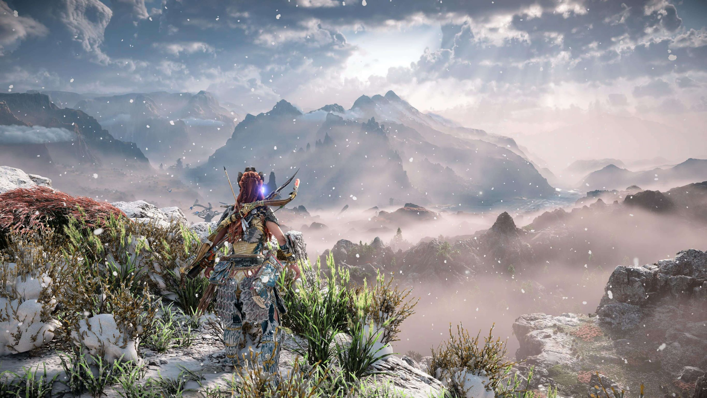
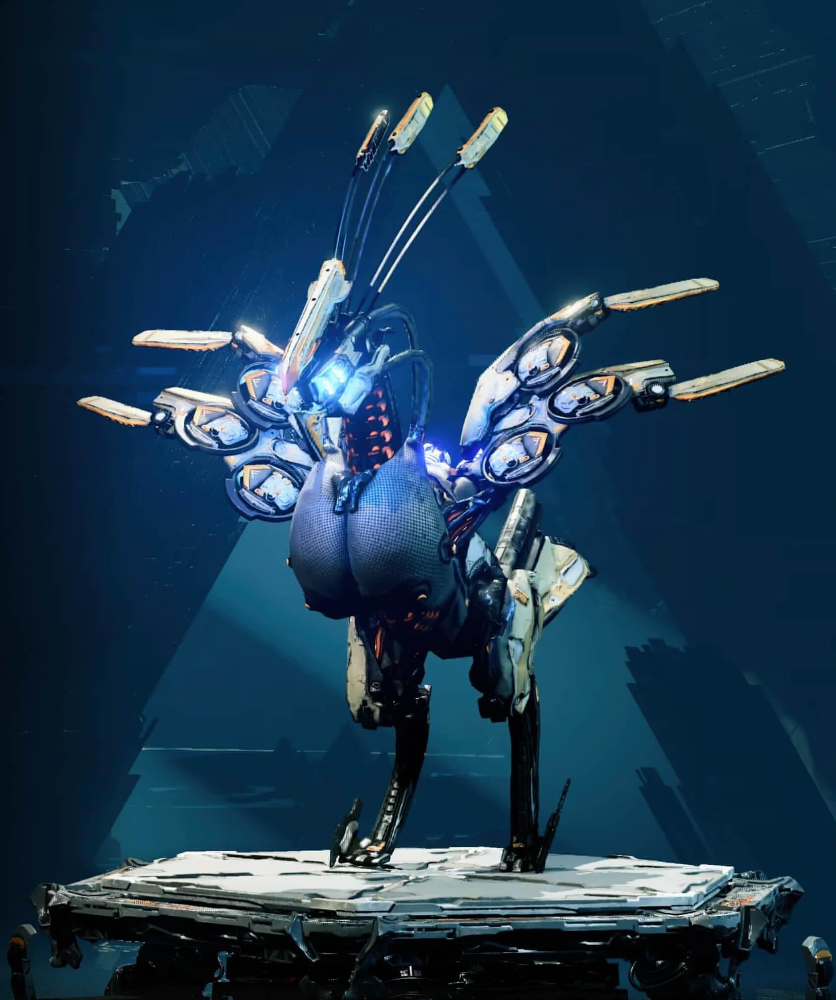

# Horizon Gaming Community

The Horizon Gaming Community website has been developed for all the Horizon game franchise (Zero Dawn and Forbidden West) fans out there. The user can join the site's community to connect with fellow gaming nerds, view the machine catalogue to get tips on how to defeat the machines in the games, and read up about the history of the games and how they were developed by the game studio Guerrilla Games. 

## Features 

In this section, you should go over the different parts of your project, and describe each in a sentence or so. You will need to explain what value each of the features provides for the user, focusing on who this website is for, what it is that they want to achieve and how your project is the best way to help them achieve these things.

### Existing Features

- __Navigation Bar__

  - Featured on all three pages, the full responsive navigation bar includes links to the Site Name, as well as Sign Up, Machine Catalogue and Game History pages and is identical on each page to allow for easy navigation.
  - This section will allow the user to easily navigate from page to page across all devices without having to revert back to the previous page via the ‘back’ button. 

- __The landing page image__

  - The landing includes a photograph with text overlay to allow the user to see exactly which location this site would be applicable to. 
  - This section introduces the user to Love Running with an eye catching animation to grab their attention

- __Club Ethos Section__

  - The club ethos section will allow the user to see the benefits of joining the Love Running meetups, as well as the benefits of running overall. 
  - This user will see the value of signing up for the Love Running meetups. This should encourage the user to consider running as their form of exercise. 

- __Meetup Times section__

  - This section will allow the user to see exactly when the meetups will happen, where they will be located and how long the run will be in kilometers. 
  - This section will be updated as these times change to keep the user up to date. 

- __The Footer__ 

  - The footer section includes links to the relevant social media sites for Love Running. The links will open to a new tab to allow easy navigation for the user. 
  - The footer is valuable to the user as it encourages them to keep connected via social media

- __Gallery__

  - The gallery will provide the user with supporting images to see what the meet ups look like. 
  - This section is valuable to the user as they will be able to easily identify the types of events the organisation puts together. 

- __The Sign Up Page__

  - This page will allow the user to get signed up to Love Running to start their running journey with the community. The user will be able specify if they would like to take part in road, trail or both types of running. The user will be asked to submit their full name and email address. 

For some/all of your features, you may choose to reference the specific project files that implement them.

In addition, you may also use this section to discuss plans for additional features to be implemented in the future:

### Features Left to Implement

- Another feature idea

## Testing 

In this section, you need to convince the assessor that you have conducted enough testing to legitimately believe that the site works well. Essentially, in this part you will want to go over all of your project’s features and ensure that they all work as intended, with the project providing an easy and straightforward way for the users to achieve their goals.

In addition, you should mention in this section how your project looks and works on different browsers and screen sizes.

You should also mention in this section any interesting bugs or problems you discovered during your testing, even if you haven't addressed them yet.

If this section grows too long, you may want to split it off into a separate file and link to it from here.

### Validator Testing 

- HTML
  - No errors were returned when passing through the official [W3C validator](https://validator.w3.org/nu/?doc=https%3A%2F%2Fcode-institute-org.github.io%2Flove-running-2.0%2Findex.html)
- CSS
  - No errors were found when passing through the official [(Jigsaw) validator](https://jigsaw.w3.org/css-validator/validator?uri=https%3A%2F%2Fvalidator.w3.org%2Fnu%2F%3Fdoc%3Dhttps%253A%252F%252Fcode-institute-org.github.io%252Flove-running-2.0%252Findex.html&profile=css3svg&usermedium=all&warning=1&vextwarning=&lang=en#css)

### Unfixed Bugs

You will need to mention unfixed bugs and why they were not fixed. This section should include shortcomings of the frameworks or technologies used. Although time can be a big variable to consider, paucity of time and difficulty understanding implementation is not a valid reason to leave bugs unfixed. 

## Deployment

This section should describe the process you went through to deploy the project to a hosting platform (e.g. GitHub) 

- The site was deployed to GitHub pages. The steps to deploy are as follows: 
  - In the GitHub repository, navigate to the Settings tab 
  - Click on the Pages section under Code and Automation
  - From the source section drop-down menu, select the main branch and click save
  - A ribbon display appears explaining that the deployment process has started
  - Once the process is complete the ribbon turns green and indicates that the site has successfully published 

The live link can be found here - https://alexah88.github.io/portfolio-project-1/

## Credits 

### Content 

- The [About The Games](https://alexah88.github.io/portfolio-project-1/index.html) page content is taken from [Wikipedia](https://en.wikipedia.org/wiki/Main_Page), notably [Horizon Zero Dawn](https://en.wikipedia.org/wiki/Horizon_Zero_Dawn) and [Horizon Forbidden West](https://en.wikipedia.org/wiki/Horizon_Forbidden_West).
- The [Game Developer History](https://alexah88.github.io/portfolio-project-1/game-developer-history.html) page content is taken from [Wikipedia](https://en.wikipedia.org/wiki/Main_Page), notably [Guerrilla Games](https://en.wikipedia.org/wiki/Guerrilla_Games).
- The two fonts on the site are taken from [Google Fonts](https://fonts.google.com/) and are [Hubballi](https://fonts.google.com/specimen/Hubballi?query=hubball) for the body and [Mina](https://fonts.google.com/specimen/Mina?query=mina) for the h1, h2, h3 headings.  
- The icons on the site are taken from [Font Awesome](https://fontawesome.com/).

### Media

- The four hero images on the About The Games, Game Developer History, Machine Catalogue, and Sign Up pages are taken from [Flickr](https://www.flickr.com/) and are credited as follows:
  - [About The Games Hero Image](https://live.staticflickr.com/65535/50957859957_438eac90f0_k.jpg) by [Barkar B](https://www.flickr.com/people/141604050@N05/)
    
  - [Game Developer History Hero Image](https://live.staticflickr.com/65535/50945317813_2106d0489c_k.jpg) by [Barkar B](https://www.flickr.com/people/141604050@N05/)
    
  - [Machine Catalogue Page Hero Image](https://live.staticflickr.com/65535/50588087452_81684a2c39_h.jpg) by [Natty Dread](https://www.flickr.com/photos/nattydread011/)
    
  - [Sign Up Page Hero Image](https://live.staticflickr.com/65535/50587215813_6395b6b86d_h.jpg) by [Natty Dread](https://www.flickr.com/photos/nattydread011/)
    

- The two video trailers on the About The Games page are taken from the official [PlayStation YouTube Page](https://www.youtube.com/channel/UC-2Y8dQb0S6DtpxNgAKoJKA) and are credited as follows:
  - [Horizon Zero Dawn Trailer](https://www.youtube.com/watch?v=wzx96gYA8ek)
  - [Horizon Forbidden West Trailer](https://www.youtube.com/watch?v=Lq594XmpPBg&t=4s)

- The six images used for the Machine Catalogue page were also taken from [Flickr](https://www.flickr.com/) and are credited as follows:
  - [Stormbird Image](https://live.staticflickr.com/65535/50243038547_01889baec9_h.jpg) by [Loyd](https://www.flickr.com/photos/155101337@N06/)
    
  - [Longleg Image](https://live.staticflickr.com/65535/50304729508_6e5e269150_z.jpg) by [Loyd](https://www.flickr.com/photos/155101337@N06/)
    
  - [Sawtooth Image](https://live.staticflickr.com/65535/50229192026_a3bd8cd8b3_z.jpg) by [Loyd](https://www.flickr.com/photos/155101337@N06/)
    
  - [Watcher Image](https://live.staticflickr.com/2872/32383521443_de8f58b4bf_h.jpg) by [Midhras](https://www.flickr.com/photos/midhras/)
    
  - [Thunderjaw Image](https://live.staticflickr.com/65535/50301828211_aeb138adf4_k.jpg) by [Loyd](https://www.flickr.com/photos/155101337@N06/)
    
  - [Strider Image](https://live.staticflickr.com/65535/50205975807_83428a99e9_z.jpg) by [Loyd](https://www.flickr.com/photos/155101337@N06/)
    

### Code

- [Code Institute LMS](https://learn.codeinstitute.net/ci_program/diplomainsoftwaredevelopmentecommerce), in particular the [Love Running Walkthrough Project](https://learn.codeinstitute.net/courses/course-v1:CodeInstitute+LR101+2021_T1/courseware/4a07c57382724cfda5834497317f24d5/f2db5fd401004fccb43b01a6066a5333/) for HTML and CSS code. 
- [W3Schools](https://www.w3schools.com/) and [Stack Overflow](https://stackoverflow.com/) for HTML and CSS code. 